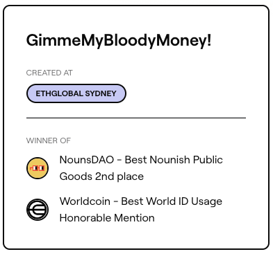
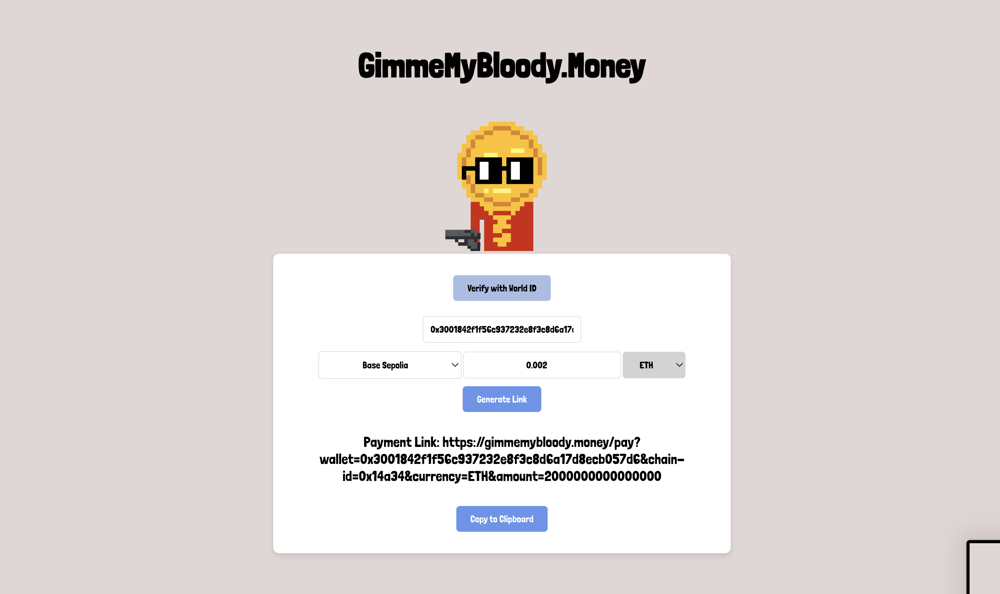
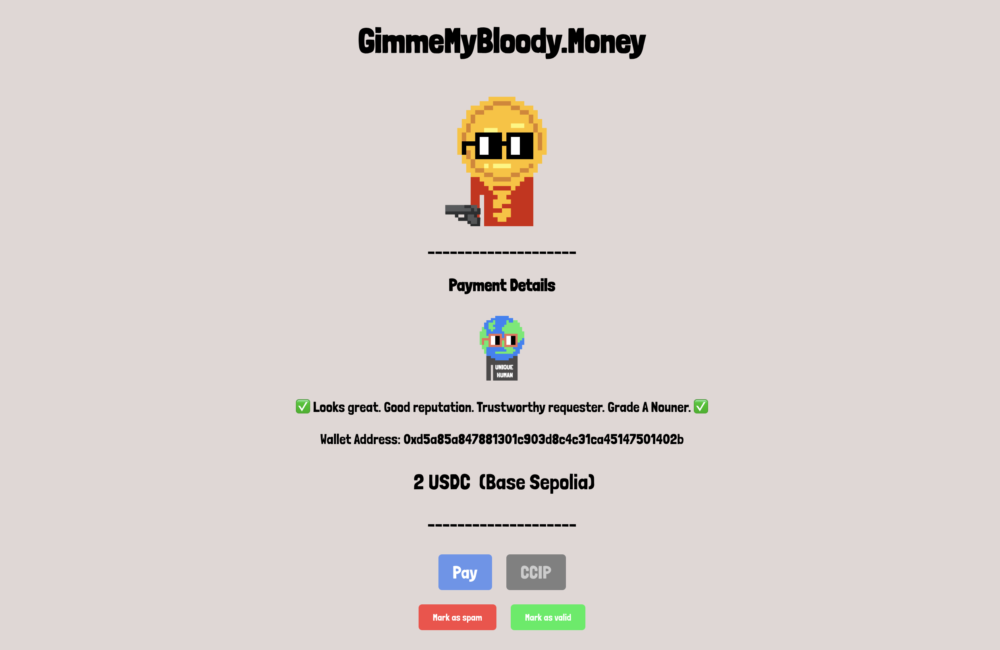

<h1>Gimme My Bloody Money 💰</h1>
<h3>Created for EthGlobal Sydney 2024</h3>

This project creates a straightforward way of requesting money. Users can generate a link, which others can click to directly sign the correct transaction.

## DEMO: **[gimmemybloody.money](https://gimmemybloody.money/)**
## Project Page: **[EthGlobal](https://ethglobal.com/showcase/gimmemybloodymoney-vi6xx)**

## description
This project simplifies the process of requesting money through a straightforward, two-page online system.
On the first page, users fill out a form to specify their receiving address, desired currency, preferred blockchain, and amount. Once the form is submitted, a link is generated which users can share with others.
When the link is clicked, it directs the user to the payment page.
On the payment page, the recipient can review the transaction details before signing the transaction with a single click of a button.
To enhance trust, the user creating the request can verify their identity using World ID. This assures the recipient that the request is from a real person and not an automated bot.
Furthermore, recipients can label these requests as spam or legitimate and confirm their choice by signing with World ID. This feature helps to swiftly identify and curb potential scams, as wallets with a negative reputation will be flagged as risky on the payment page.
If the recipient lacks sufficient funds on the requested chain, the system can automatically locate and utilize funds from other chains using CCIP. If the user opts for this feature, they will be guided through the necessary transactions step by step.

## request generator

## payment

## technical
The frontend comprises two React-based pages that interact solely with the blockchain, eliminating the need for any backend services.
On the request page, users can generate a link that embeds all essential details (such as blockchain, recipient address, currency, and amount) directly into the query parameters. This design eliminates the need to sign any transaction. Additionally, users opting to authenticate via World ID need to connect their wallet, scan a World ID QR code using the IDKitWidget from Worldcoin and sign the transaction to submit the proof onchain. The signal of the proof is the users wallet eliminitating any chance of tampering with it.
All proves are stored on Base, since there is no need to submit proves on multiple chains, as the owner of the address is the same one on all chains. 
Users can easily update their address by verifying a new one. This automatically replaces the previously verified address and transfers all accumulated reputation to the new address.

The payment page retrieves all necessary information from the query parameters and displays it for user verification. In scenarios where there are sufficient funds available in the specified currency on the correct chain, the "Pay" button is activated, allowing the user to simply click it to sign the transaction.
If the frontend detects insufficient funds on the expected chain, it searches for an alternative chain with adequate funds and uses Chainlink CCIP to bridge the funds directly to the recipient's address on the correct chain. Currently CCIP is limited to USDC.
Users can categorize a request as either valid or spam by submitting a proof through WorldID. The signal is a simple boolean indicating whether their feedback is positive or negative, and the action includes the wallet address. This system ensures each vote remains anonymous while preventing double voting.
If a request accumulates an overall negative rating, it will be flagged accordingly. This feature aims to safeguard less experienced users by highlighting potentiall phishing attempts.

## getting started

To run the frontend simply do

- `cd app`
- `npm i`
- `npm start`

or fork it and deploy it on vercel

The smart contract can be found in smart_contract. Since World ID did not work on the testchains at the time of writing this, the proof verification has been commented out.
